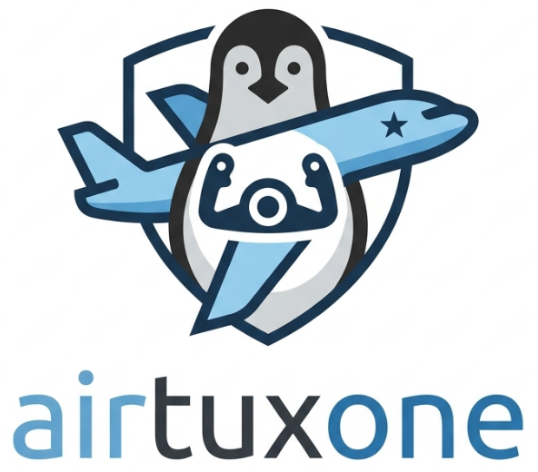

<p align="center">
  
</p>

<p align="center">
  <strong>English</strong> | <a href="README.fr.md">Français</a>
</p>

<p align="center">
  <a href="LICENSE"></a>
</p>

# AirTuxOne

AirTuxOne is a Linux daemon that maps a **Turtle Beach VelocityOne Flightstick** to one or more **virtual Xbox 360 controllers**. It is designed to fly Microsoft Flight Simulator with the stick, its buttons, and throttle levers, even from an older Linux PC, using a cloud gaming service such as GeForce NOW and a Firefox browser.

## Why AirTuxOne?

AirTuxOne was designed to address the following challenge: how can you play Flight Simulator 2020 or 2024 from a relatively old PC that does not have enough power to run the game, on a Linux system, while still enjoying the comfort of a joystick?

The first answer was to use a cloud gaming service. This provides the power needed for a game such as Flight Simulator while streaming the rendered display to a PC that only needs to show the stream. With this approach, it is easy to play the simulator with a keyboard and mouse or a standard Xbox controller, both recognized by the cloud gaming service and the game. But it was still frustrating not to be able to play with a joystick better suited to a flight simulator.

The second answer was therefore to make the joystick appear as one or more virtual Xbox controllers, so that the various buttons, axes, and throttle levers can then be configured directly in the simulator.

Warning:
- Firefox and GeForce NOW are third-party solutions. The AirTuxOne author is not responsible for their operation.
- GeForce NOW requires a paid subscription.

## Quick install

```bash
git clone https://github.com/Denis-lab-911/airtuxone.git
cd airtuxone
chmod +x setup.sh airtuxone.sh
./setup.sh
```

The `setup.sh` script automates:

- system packages (`python3-venv`, `evtest`, …)
- `.venv/` creation and Python dependencies
- persistent `uinput` kernel module loading
- adding your user to the dedicated `airtux-input` and `uinput` groups
- optional udev rules for the VelocityOne

**Important:** log out and back in (or reboot) after group changes before starting the daemon.

### Diagnostics

```bash
./setup.sh --check
```

### Skip apt install

If the APT update manager (`aptk`) locks apt:

```bash
./setup.sh --skip-apt
```

If `apt-get update` fails due to a third-party repo (`NO_PUBKEY`):

```bash
sudo apt install python3-venv python3-pip evtest
./setup.sh --skip-apt
```

### Skip udev rules

```bash
./setup.sh --skip-udev
```

## Manual install

```bash
sudo apt install python3-venv python3-pip evtest
python3 -m venv .venv
source .venv/bin/activate
pip install -r requirements.txt
sudo modprobe uinput
echo uinput | sudo tee /etc/modules-load.d/uinput.conf
sudo usermod -aG airtux-input,uinput $USER
# Log out and back in after group changes
```

## Configuration

The base mapping connects the joystick and its buttons to a single virtual Xbox controller. In this configuration, the joystick's throttle levers cannot be mapped. The base mapping is defined in [`config.toml`](config.toml). **Note: no axis or button is hardcoded in the Python code.**

To use the joystick's throttle levers, use the specialized profiles for the aircraft type:

- [`config.dual.toml`](config.dual.toml): recommended profile when a single throttle controller is enough. This profile creates:
  - one controller for the main joystick axis and its primary buttons;
  - a second virtual controller for throttle management.
- [`config.triple.toml`](config.triple.toml): profile for single-engine aircraft, twin-engine aircraft, and helicopters, with a separate virtual controller for each throttle lever, allowing both throttle levers to be used.

| Section | Role |
|---------|------|
| `[source_device]` | Source flightstick detection (name, vendor, product) |
| `[daemon]` | Daemon options (`grab_source`, `log_level`) |
| `[virtual_controller_1]` | First virtual controller; its role depends on the selected profile |
| `[virtual_controller_2]` | Second virtual controller; its role depends on the selected profile |
| `[virtual_controller_3]` | Optional third controller in the triple profile |

| Profile | Controller layout |
|---------|-------------------|
| Base (`config.toml`) | 1: **AirTuxOne** flight stick |
| Dual (`config.dual.toml`) | 1: **AirTuxOne** flight stick; 2: **AirTuxOne - Throttle** |
| Triple (`config.triple.toml`) | 1: **AirTuxOne** flight stick; 2: **Throttle 1**; 3: **Throttle 2** |

### Triple profile overview

```text
                               AIRTUX ONE TRIPLE (MAPPING)

   +---------------------------------------+
   |   TURTLE BEACH VELOCITYONE (PC Mode)  |
   +---------------------------------------+
                      |
                      | (evdev)
                      v
   +---------------------------------------+
   |           AIRTUX ONE DAEMON           |
   +---------------------------------------+
                      |
                      | (uinput)
        +-------------+-------------+
        |             |             |
        v             v             v
  [Controller 1] [Controller 2] [Controller 3]
```

### Detailed mapping view

```text
========================================================================================
SOURCE: JOYSTICK PHYSICAL LAYOUT                 TARGET VIRTUAL XBOX CONTROLLERS
========================================================================================

--- STICK HEAD ---
┌───────────────────────────────────────┐
│ [H1 Hat] POV hat                      │───────► Controller 1: D-pad
│ [H2 Stick] Analog mini-stick          │───────► Controller 1: Right stick (look / camera)
│                                       │
│ [B1] Main trigger                     │───────► Controller 1: A button
│ [B2] Left thumb button                │───────► Controller 1: B button
│ [B3] Right thumb button               │───────► Controller 1: X button
│ [B4] Top button                       │───────► Controller 1: Y button
│                                       │
│ [B5] Upper top button                 │───────► Controller 1: Combo [LB + A]
│ [B6] Upper bottom button              │───────► Controller 1: Combo [LB + B]
│ [B7] Upper side button                │───────► Controller 1: Combo [LB + X]
│ [B8] Lower side button                │───────► Controller 1: Combo [LB + Y]
│ [Secondary trigger]                   │───────► Controller 1: RB button
└───────────────────────────────────────┘

--- BODY & BASE (AXES & BUTTONS) ---
┌───────────────────────────────────────┐
│ X axis (stick horizontal axis)        │───────► Controller 1: Left stick X (roll)
│ Y axis (stick vertical axis)          │───────► Controller 1: Left stick Y (pitch)
│ Z axis (stick twist)                  │───────► Controller 1: LT / RT triggers (rudder)
│                                       │
│ [B16] Base button                     │───────► Controller 1: LB button (modifier)
│ [Bottom-left] Base button             │───────► Controller 1: Back / Select button
│ [Bottom-center] Base button           │───────► Controller 1: L3 button (left thumb)
│ [Bottom-right] Base button            │───────► Controller 1: Start button
│ [Xbox logo] Center button             │───────► Controller 1: Guide / Xbox button
└───────────────────────────────────────┘

--- THROTTLE QUADRANT ---
┌───────────────────────────────────────┐
│ Lever 1 (RZ axis)                     │───────► Controller 2: Left stick Y (Throttle 1)
│ Lever 2 (Throttle axis)               │───────► Controller 3: Right stick Y (Throttle 2)
└───────────────────────────────────────┘
```

MSFS mapping is documented in [`docs/en/mapping_velocityone_xbox.md`](docs/en/mapping_velocityone_xbox.md).

### PC mode required

The VelocityOne joystick starts in **Xbox mode** by default. Under Linux, the **`xpad`** driver exposes throttle levers as discrete values only (`0`, `1`, `32768`). **Switch to PC mode** on the stick OLED (Configurator → Input Mode → PC), then verify with `./setup.sh --check` and `evtest`.

### Discover evdev codes

```bash
source .venv/bin/activate
python -m airtux_one.discover
```

Mapping assistant with a physical Xbox controller:

```bash
python -m airtux_one.learn
```

Alternate config path:

```bash
export AIRTUX_CONFIG=/path/to/config.toml
```

## Running the daemon

The recommended launch procedure is as follows:

1) Open a terminal
2) Launch the AirTuxOne script, choosing the one-, two-, or three-controller profile
3) Open your browser to access the streaming service and the game
4) Launch the streaming service and then the game

**Command to launch the "one virtual controller" profile:**

```bash
./airtuxone.sh
```

**Command to launch the _dual_ "two virtual controllers" profile** (one throttle lever on a second virtual Xbox controller):

```bash
./airtuxone-dual.sh
```

Warning: Firefox is the recommended browser for multi-controller profiles.

Note: the multi-controller profiles (dual or triple) are designed and tested for **Firefox + GeForce NOW**. They are not reliable in **Chrome** for this specific setup, where additional virtual controllers are not always exposed correctly. The profiles have not been tested with other browsers, streaming services, or games.

**Command to launch the _triple_ three-controller profile** (two separate throttle levers on distinct virtual Xbox controllers):

```bash
./airtuxone-triple.sh
```

**Important:** the _triple_ profile is required for GeForce NOW and MSFS to see distinct devices for **Throttle 1** and **Throttle 2**. This makes it possible to use both analog throttle levers on the joystick.

## Stopping the daemon

Clean shutdown: `Ctrl+C` or `kill -TERM <pid>` in the terminal where the daemon is running.

## Using virtual controllers in MSFS

In MSFS, moving the different axes or buttons allows the game to detect the different virtual controllers (for example, "Controller 1", "Controller 2", and "Controller 3" when using the _triple_ profile).

## Verification

### Virtual controller (evtest / jstest)

```bash
evtest    # select « AirTuxOne »
jstest /dev/input/jsN
```

### Browser (GeForce NOW / Firefox)

1. Start the daemon first
2. Use **Firefox**
3. Select **AirTuxOne** (`vendor 045e`, `product 02a1`) in the tester (for example: https://hardwaretester.com/gamepad) or MSFS

## Troubleshooting

| Issue | Fix |
|-------|-----|
| `Device or resource busy` on startup | Close jstest/evtest and Firefox tabs; restart `./airtuxone.sh` or one of its dual/triple variants |
| `Permission denied` on `/dev/input/*` | `./setup.sh` or `sudo usermod -aG airtux-input $USER` + re-login |
| `Permission denied` on `/dev/uinput` | `./setup.sh` + re-login |
| Source device not found | Plug in VelocityOne; `./setup.sh --check`; **PC mode** on stick |
| Throttle not analog (evtest: 0, 1, 32768) | Xbox mode active — switch to **PC mode** |
| Wrong controller in browser | Select **AirTuxOne** (`045e:02a1`) |
| Wrong axis codes | `python -m airtux_one.discover` then update `config.toml` |

## Security

- Do **not** run the daemon as root.
- Use only the dedicated `airtux-input` and `uinput` groups installed by `./setup.sh`.
- `airtux-input` is limited to the VelocityOne; do not add users to the global `input` group for AirTuxOne. Existing members can leave it with `sudo gpasswd -d $USER input` only after confirming no other application needs it.
- Exclusive grab (`grab_source`) blocks other readers of the physical stick.

## Project layout

```
airtuxone/
├── airtuxone_logo.png
├── airtuxone.sh
├── airtuxone-dual.sh
├── airtuxone-triple.sh
├── config.toml
├── config.dual.toml
├── config.triple.toml
├── CONTRIBUTING.md
├── docs/
│   ├── en/mapping_velocityone_xbox.md
│   └── fr/mapping_velocityone_xbox.md
├── LICENSE
├── README.md
├── README.fr.md
├── requirements.txt
├── setup.sh
├── install-desktop.sh
├── install-desktop-dual.sh
├── install-desktop-triple.sh
└── airtux_one/
    ├── core.py
    ├── devices.py
    ├── discover.py
    ├── learn.py
    └── mapper.py
```

## Advanced user

This is an optional setup intended to enable automatic startup of the AirTuxOne script when a graphical session begins. It does not select a profile by itself: you must point it to the configuration matching the profile you want to use (`config.toml`, `config.dual.toml`, or `config.triple.toml`).

### Automatic startup with systemd

Create `~/.config/systemd/user/airtux-one.service`:

```ini
[Unit]
Description=AirTuxOne flight stick mapper
After=graphical-session.target

[Service]
ExecStart=/path/to/airtuxone/.venv/bin/python -m airtux_one.core
WorkingDirectory=/path/to/airtuxone
Restart=on-failure
Environment=AIRTUX_CONFIG=/path/to/airtuxone/config.toml

[Install]
WantedBy=default.target
```

For a dual or triple profile, replace `config.toml` with `config.dual.toml` or `config.triple.toml` in the `Environment` variable, then enable the service with:

```bash
systemctl --user daemon-reload
systemctl --user enable --now airtux-one.service
```

## License

This project is licensed under the [GNU General Public License v3.0](LICENSE) (GPL-3.0).

## Contributing

See [CONTRIBUTING.md](CONTRIBUTING.md).
